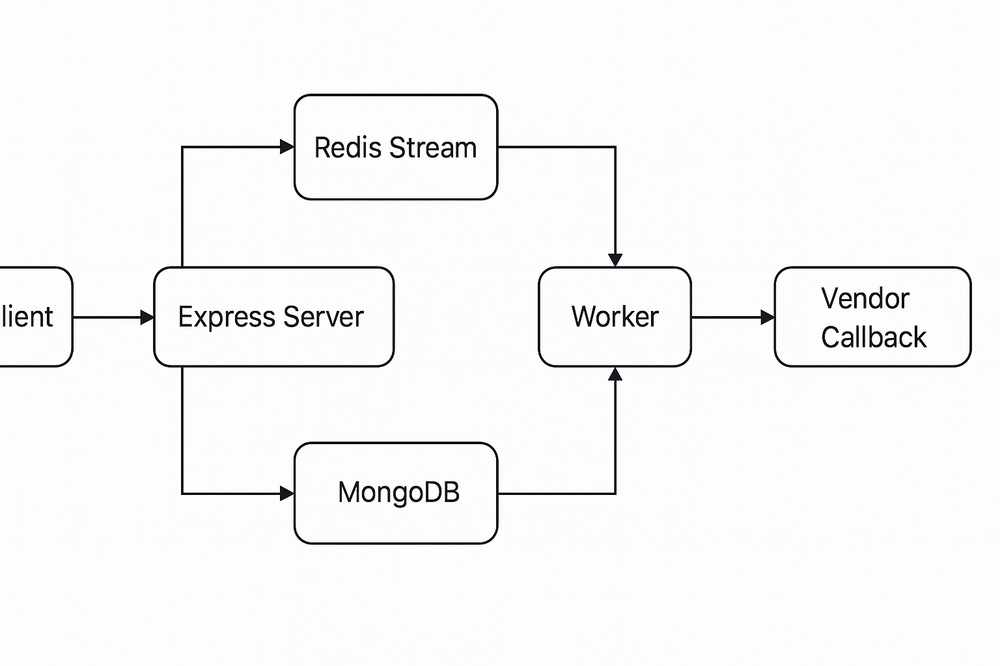

# Multi-Vendor Data Fetch Service

A backend system to fetch and process data from multiple vendor APIs using a job queue with Redis Streams, Docker, and MongoDB. Includes performance load testing with k6.

---
## Tech Stack Used
- Node.js + Express
- MongoDB Atlas (Mongoose)
- Redis Streams for queuing
- Docker & Docker Compose
- Axios for HTTP requests
- dotenv for config management
- k6 for load testing

---

## Features

- `POST /jobs`: Accepts job payload, queues it, returns `requestId`.
- `GET /jobs/:id`: Fetch job status/result.
- `/vendors/sync`: Processes jobs immediately.
- `/vendors/async`: Delays and sends webhook after processing.
- `/webhook`: Receives result and marks job complete.
- Redis Stream (`jobStream`) queues jobs for a **worker**.
- Dockerized setup: Redis + Server + Worker.

---
## How to Run

# 1. Clone the repo :-  
- git clone <repo-url> 
- cd multi-vendor-fetch

# 2. Add .env file :-   
- MONGO_USERNAME=your_username
- MONGO_PASSWORD=your_password
- MONGO_CLUSTER=your_cluster_url
- MONGO_DB=your_db_name
- PORT=8080 (used in this project can be changed accordingly)

# 3. Start Using docker :- docker-compose up --build (app runs at http://localhost:8080)

---
## Load Testing Script :- k6 run loadTest.js (requires k6 to be installed)
---
## Architecture diagram

## Postman Collection
Postman collection included: [`multi-vendor-jobd-fetch.postman_collection.json`](./multi-vendor-jobd-fetch.postman_collection.json)

## Design Decision Trade offs
- Redis Streams was used for job queuing due to its simplicity, persistence, and support for consumer groups. It’s lighter than Kafka but may not scale as well in high-throughput production environments.
 Jobs are randomly processed via /vendors/sync or /vendors/async to simulate real-world variability in vendor response times. Async jobs trigger a webhook callback after processing.
- k6 was chosen for load testing because of its JS-based scripting and ease of simulating concurrent API traffic. It suits backend performance testing well.
- Docker Compose ensures consistent, reproducible environments across Redis, MongoDB, and Node.js services.
---
##  Load Testing

Load test script: [`loadTest.js`](./loadTest.js)  
Raw results: [`result.txt`](./result.txt)

### Load Test Summary
- 200 VUs ran for 60 seconds.
- API handled sustained load successfully.
- No major failures observed under simulated conditions.
